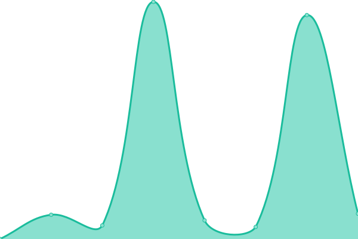

# [📈 Live Status](https://Comparacar.github.io/uptime): <!--live status--> **🟩 All systems operational**

This repository contains the open-source uptime monitor and status page for [ComparaCAR ](https://comparacar.com.br), powered by [Upptime](https://github.com/upptime/upptime).

With [Upptime](https://upptime.js.org), you can get your own unlimited and free uptime monitor and status page, powered entirely by a GitHub repository. We use [Issues](https://github.com/Comparacar/uptime/issues) as incident reports, [Actions](https://github.com/Comparacar/uptime/actions) as uptime monitors, and [Pages](https://Comparacar.github.io/uptime) for the status page.

<!--start: status pages-->
<!-- This summary is generated by Upptime (https://github.com/upptime/upptime) -->
<!-- Do not edit this manually, your changes will be overwritten -->
<!-- prettier-ignore -->
| URL | Status | History | Response Time | Uptime |
| --- | ------ | ------- | ------------- | ------ |
|  [/assinar](https://www.comparacar.com.br/assinar) | 🟩 Up | [assinar.yml](https://github.com/comparacar/uptime/commits/HEAD/history/assinar.yml) | 

 404ms
     
 | 

<a href="https://Comparacar.github.io/uptime/history/assinar">100.00%</a>
    

|  [/assinar/carro](https://www.comparacar.com.br/assinar/carro) | 🟩 Up | [assinar-carro.yml](https://github.com/comparacar/uptime/commits/HEAD/history/assinar-carro.yml) | 

 1780ms
     
 | 

<a href="https://Comparacar.github.io/uptime/history/assinar-carro">100.00%</a>
    

|  [/comprar/carro](https://www.comparacar.com.br/comprar/carro) | 🟩 Up | [comprar-carro.yml](https://github.com/comparacar/uptime/commits/HEAD/history/comprar-carro.yml) | 

 5242ms
     
 | 

<a href="https://Comparacar.github.io/uptime/history/comprar-carro">99.96%</a>
    

<!--end: status pages-->

[**Visit our status website →**](https://Comparacar.github.io/uptime)

## 📄 License

- Powered by: [Upptime](https://github.com/upptime/upptime)
- Code: [MIT](./LICENSE) © [ComparaCAR ](https://comparacar.com.br)
- Data in the `./history` directory: [Open Database License](https://opendatacommons.org/licenses/odbl/1-0/)
